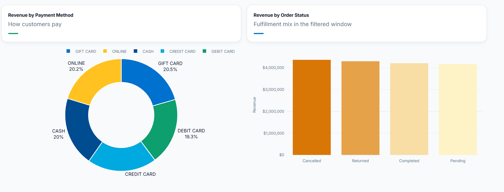
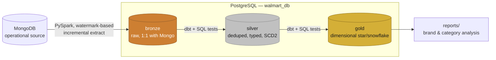
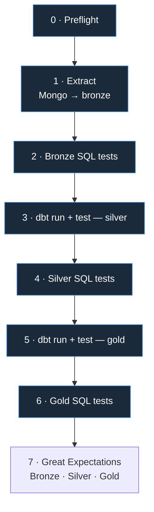

<p align="center">
  <a href="https://github.com/Nitinx12/Walmart_DBT">
    
  </a>
</p>

<h1 align="center">DBT Medallion Data Pipeline</h1>

<p align="center">
  A production-style <b>MongoDB → PostgreSQL → dbt</b> pipeline: incremental PySpark extraction,<br/>
  a tested medallion warehouse (<b>bronze → silver → gold</b>), orchestrated with <b>Airflow</b>,<br/>
  containerized with <b>Docker</b>, and gated by two independent layers of data-quality checks at every handoff.
</p>
<p align="center">
  <em>Built to mirror how a real analytics-engineering team would ship this — not a notebook demo.</em>
</p>

<!-- Primary stack -->
<p align="center">
  
  
  
  
  
  
  
  
  
</p>

<!-- Tooling & quality -->
<p align="center">
  
  
  <a href="https://github.com/Nitinx12/Walmart_DBT/actions/workflows/ci.yml"></a>
  <a href="https://github.com/Nitinx12/Walmart_DBT/releases"></a>
  
  
  <a href="LICENSE"></a>
</p>

<!-- Community -->
<p align="center">
  <a href="https://discord.gg/"></a>
  <a href="https://www.linkedin.com/"></a>
  <a href="https://twitter.com/"></a>
  <a href="https://github.com/vinta/awesome-python"></a>
</p>

<p align="center">
  <a href="https://walmartdbt-b3fdfqwyky3ghzr5syyxtu.streamlit.app/"></a>
  &nbsp;
  <a href="https://github.com/Nitinx12/Walmart_DBT"></a>
</p>

---

## Live Dashboard

<p align="center">
  <a href="https://walmartdbt-b3fdfqwyky3ghzr5syyxtu.streamlit.app/"><b>Live Demo</b></a> &mdash; interactive dashboard on the <code>gold</code> schema &middot; <a href="dashboard/README.md">docs</a>
</p>

<p align="center">
  <a href="https://walmartdbt-b3fdfqwyky3ghzr5syyxtu.streamlit.app/">
    
  </a>
</p>
<p align="center"><sub>Seeded demo DB &mdash; not the live pipeline. See <a href="scripts/python/seed_demo_db.py"><code>seed_demo_db.py</code></a>.</sub></p>

## Architecture at a glance

<p align="center">
  
  &nbsp;
  
  
  
</p>



<p align="center"><sub>Every arrow into <code>silver</code> and <code>gold</code> is a <b>quality gate</b> — the next layer only builds if the prior layer's tests pass. Full breakdown: <a href="docs/architecture.md"><code>docs/architecture.md</code></a> §4.</sub></p>

## Orchestration — one pipeline, run three ways

The same eight stages run locally via PowerShell, on a schedule in Airflow, or through the standalone Docker runner:



<p align="center"><sub>In Airflow this is <code>walmart_medallion_pipeline</code>, with <code>all_success</code> trigger rules stopping the DAG the moment any stage fails. Full DAG detail: <a href="docs/airflow.md"><code>docs/airflow.md</code></a>.</sub></p>

## Highlights

| Area | What's there |
|---|---|
| **Incremental extraction** | Watermark-based `$gt` pushdown from Mongo, real `MERGE`-style upserts, automatic fallback when no watermark or unique index exists |
| **Modeling** | 17 dbt models (9 silver + 8 gold), 100+ tests, SCD Type 2 snapshots |
| **Data quality** | dbt-native tests, standalone schema-driven SQL checks, and a final Great Expectations gate across Bronze, Silver, and Gold |
| **Runners** | Windows/PowerShell, Airflow, and the standalone runner execute the same eight stages |
| **Containerization** | Docker Compose stack (CeleryExecutor: scheduler, workers, triggerer, Redis) plus a self-contained pipeline image |
| **Dashboard** | Professional Streamlit + Plotly dashboard querying the gold schema directly — [live demo](https://walmartdbt-b3fdfqwyky3ghzr5syyxtu.streamlit.app/), source in [`dashboard/`](dashboard/) |
| **CI/CD** | Lint, DAG-integrity checks, and a live bronze→silver→gold run against Postgres on every PR; images published to GHCR on merge — [`docs/ci-cd.md`](docs/ci-cd.md) |

## Tech Stack

<p align="center">

| Layer | Technology | Version / Notes |
|---|---|---|
| **Language** | Python | `3.13` (CI: `3.11`, Docker: `3.12-slim`) |
| **OS** | Ubuntu | `24.04` (CI `ubuntu-latest`, Docker `bookworm`) |
| **Compute** | PySpark | `4.1.x` (with `openjdk-17`) |
| **Warehouse** | PostgreSQL | `16` — medallion schemas `bronze` / `silver` / `gold` |
| **Source** | MongoDB | Operational source, incremental `$gt` watermark |
| **Transform** | dbt-core + dbt-postgres | `1.12` / `1.11` — 17 models, 100+ tests |
| **Orchestration** | Apache Airflow | `3.3.x` CeleryExecutor |
| **Quality** | Great Expectations | `1.21` — Bronze · Silver · Gold suites |
| **BI** | Streamlit + Plotly | `1.62` + `7.0` — gold star schema |
| **Package mgr** | uv | `uv.lock` is source of truth |
| **Lint / Format** | Ruff + SQLFluff + pre-commit | `ruff check` / `ruff format` / `sqlfluff lint` |
| **Containers** | Docker / Compose | `Dockerfile` + `Dockerfile.airflow` |
| **CI** | GitHub Actions | lint · dashboard-smoke · unit · DAG · Docker · integration |

</p>

<p align="center">
  <sub><code>Python</code> · <code>PySpark</code> · <code>dbt-core</code> · <code>PostgreSQL</code> · <code>MongoDB</code> · <code>Apache Airflow</code> · <code>Docker</code> · <code>Streamlit</code> · <code>Plotly</code> · <code>uv</code> · <code>Ruff</code> · <code>Great Expectations</code></sub>
</p>

## Run it

```powershell
# Local, Windows
./pipeline/run_pipeline.ps1

# Run Great Expectations checks alone when needed
uv run python -m pipeline.data_quality.run --layer all

# Standalone container runner (supply container-correct database hosts)
docker run --env-file .env walmart-pipeline

# Full Airflow stack
docker compose -f docker/compose.yml up

# Sales dashboard (reads from your local gold schema)
uv run streamlit run dashboard/app.py
```

## Documentation

This README is the pitch. Everything below is the engineering detail:

| Doc | Covers |
|---|---|
| [`docs/architecture.md`](docs/architecture.md) | Full system design and execution-path status |
| [`docs/airflow.md`](docs/airflow.md) | The DAG, task by task |
| [`docs/dbt.md`](docs/dbt.md) | Models, grain, SCD types, tests |
| [`docs/docker.md`](docs/docker.md) | Both images, why two, build details |
| [`docs/pipeline.md`](docs/pipeline.md) | The PowerShell entry point |
| [`docs/scripts.md`](docs/scripts.md) | `extract.py`'s incremental vs. full-reload logic |
| [`docs/tests.md`](docs/tests.md) | What the raw SQL checks actually check |
| [`docs/great-expectations.md`](docs/great-expectations.md) | Great Expectations suites, commands, artifacts, and troubleshooting |
| [`docs/utils.md`](docs/utils.md) | Shared config/connection/logging |
| [`docs/ci-cd.md`](docs/ci-cd.md) | See how CI/CD works |
| [`docs/health.md`](docs/health.md) | Local health and security checks |
| [`dashboard/README.md`](dashboard/README.md) | Dashboard design: schema, caching, chart choices |

Full pipeline script (`run_pipeline.ps1`): [view on Google Drive](https://drive.google.com/file/d/1vSPYN8GvC5cFMEHf7EVjwSq4HHAbCZRF/view?usp=sharing)

---

<p align="center">
  <sub>Built with ❤️ for the data community · <a href="LICENSE">MIT License</a> · <a href="https://github.com/Nitinx12/Walmart_DBT/issues">Report a bug</a> · <a href="https://github.com/Nitinx12/Walmart_DBT">⭐ Star on GitHub</a></sub>
</p>

<p align="center">
  <a href="https://discord.gg/"></a>
  <a href="https://www.linkedin.com/"></a>
  <a href="https://twitter.com/"></a>
</p>

📧 Reach out if you'd like a walkthrough of any part of this project.
