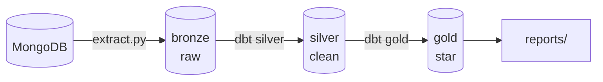

# Architecture

Medallion ETL: MongoDB → Postgres (bronze → silver → gold) with 8 quality gates.



## Pipeline (8 stages)
`0 preflight → 1 extract → 2 bronze tests → 3 dbt silver → 4 silver tests → 5 dbt gold → 6 gold tests → 7 GX`

- **Stops on first failure** (exit code check / Airflow `all_success`).
- **One logic, three runners**: `pipeline/run_pipeline.ps1` (Windows), `airflow/dags/walmart_pipeline_dag.py` (Docker), `main.py` (standalone image). Keep stage order in sync.

## Layers & Gates

- **Bronze**: `scripts/python/extract.py` — auto-discovers collections, watermark `updated_* > created_*`, `INSERT ... ON CONFLICT (_id)` upsert via `etl_watermarks`/`etl_logs`.
- **Silver**: 9 dbt models — `dbt test` + 9 SQL checks (`tests/silver/`).
- **Gold**: 8 dbt models (7 dims + 1 fact, snowflake) — `dbt test` + 7 SQL checks (`tests/gold/`).
- **Tests**: dbt tests (`schema.yml`) + standalone SQL suite (`scripts/python/sql_test.py`) — separate systems.

## Infra

- **Docker**: `docker/Dockerfile` (standalone) + `docker/Dockerfile.airflow` (Compose stack). See `docker.md`.
- **Localhost fix**: `.env` stays `localhost`; containers rewrite to `host.docker.internal` in DAG `_PREAMBLE`/`docker run`.
- **Shared**: `utils/engine.py` (env validation at import), `utils/connection.py` (cached), `utils/logger.py` (console+file).

## Layout
```
airflow/  docker/  docs/  jars/  pipeline/  scripts/python|bash/  sql/  tests/  utils/  dbt/
```

## Next
`pipeline.md` · `airflow.md` · `docker.md` · `dbt.md` · `scripts.md` · `tests.md` · `utils.md` · `health.md`
